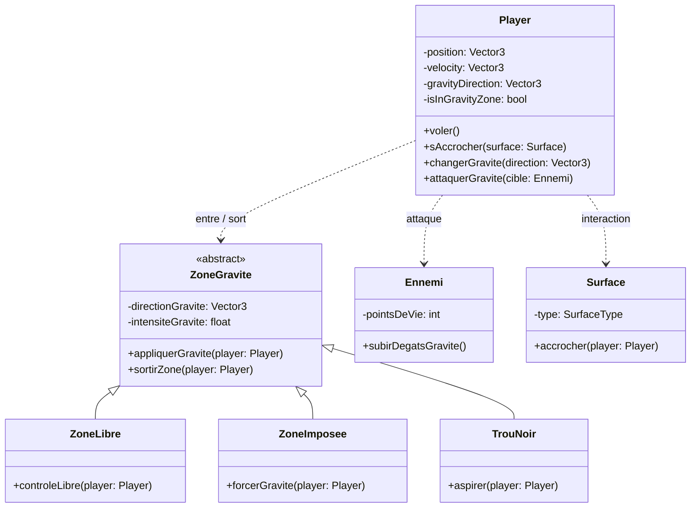
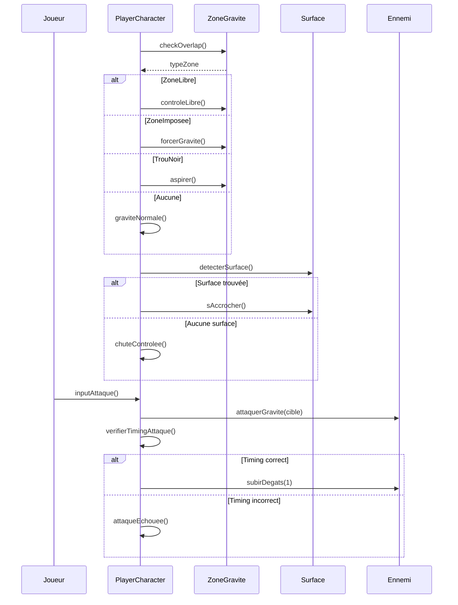
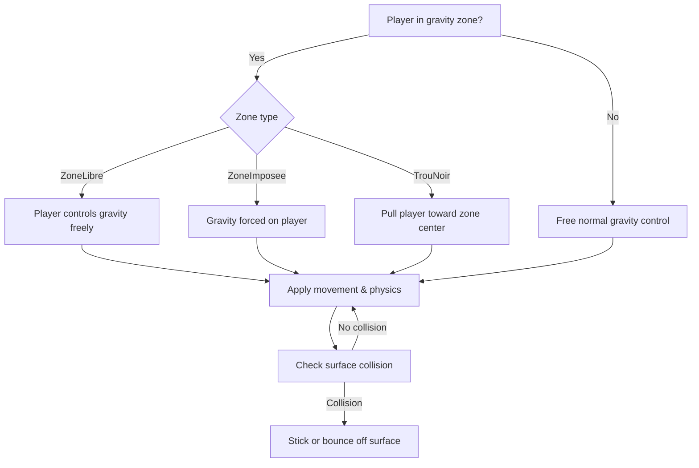

# Gravity Rush Prototype — Unreal Engine 5 Blueprint

Directional gravity mechanic inspired by *Gravity Rush*, combined with a gravity-based attack. Built in Blueprint as part of an academic UML modelling project at HEAJ (Belgium).

## Overview

The player moves through gravity zones that each apply gravity differently — free control, forced direction, or black-hole pull toward a center point. The player can stick to surfaces and trigger a gravity attack on enemies, timed to land correctly.

## Features

- Directional gravity changed by the player, applied per zone type (`ZoneLibre`, `ZoneImposee`, `TrouNoir`)
- Surface-sticking and controlled falling
- Timing-based gravity attack on enemies
- Zone detection and gravity switching handled independently of player logic

## Class Diagram

## Sequence — Gravity Attack Cycle

## Decision Logic

## Tech Stack

- Unreal Engine 5 (Blueprint)
- UML modelling (use case, class, sequence, activity diagrams)

## Author

**Loan Dzelili** — [loan-gamedev.github.io](https://loan-gamedev.github.io)
